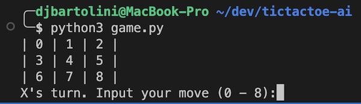
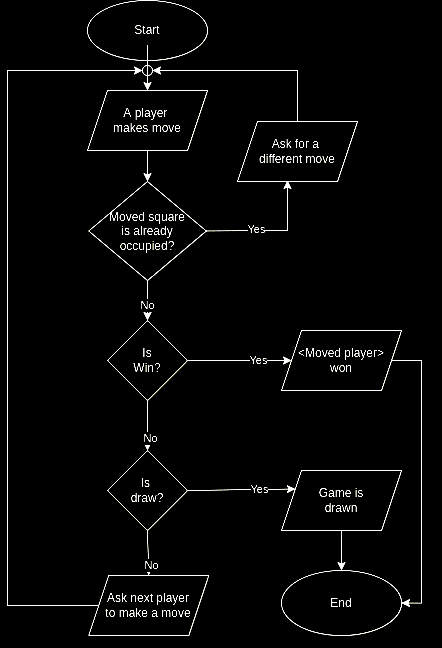
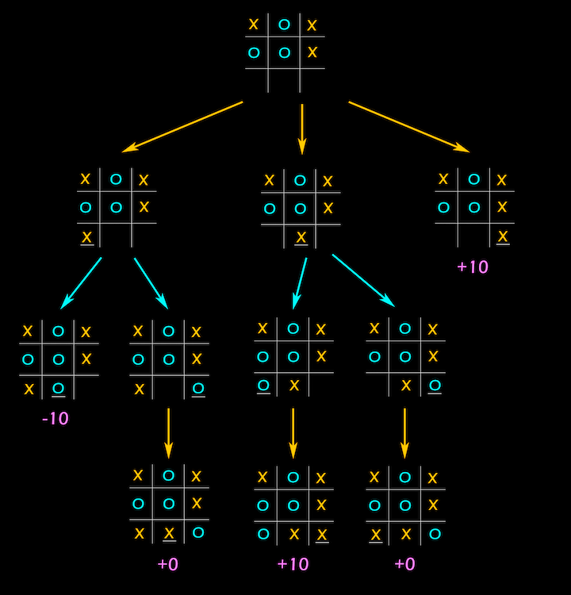

# Tic Tac Toe AI

This is a simple Python script that executes a game of tic-tac-toe in the CLI. The computer player is intelligent and is designed to never lose.

## Getting Started

After performing `git clone`, simply run:

> Mac / Linux: `python3 game.py`

> Windows: `python game.py`

Note if you are using a Windows machine you must manually install Python if you haven't already.

Upon starting a new game, you will be prompted to make your first move.
The game board squares are labeled with numbers. Choose a number to make a move:

Select a number between 0 - 8 to make your move!

## Game Flowchart

## Computer Intelligence

Thanks to the simple nature of Tac-Tac-Toe, computer intelligence is achieved through a Minimax algorithm.

The minimax algorithm uses the game state and player as arguments to simulate each possible remaining move. Scores are assigned to each possible move, with winning moves given the highest scores. Here's a visualization:

Each move's score is initialized as either infinity or negative infinity. The algorithm runs recursively to evaluate possible move. Moves that will win are given higher positive scores, whereas moves that lose are given higher negative scores. A score of 0 is given for draws. The computer will select the best move based on the calculated score.
